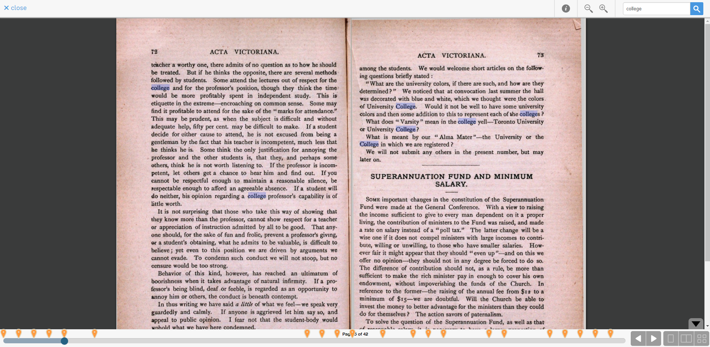

# Bookreader Plugin for Resourcespace

Internet Archive BookReader, an open-source online book viewer is now available as a plugin for ResourceSpace. IA BookReader comes with many unique features such as text search and is also mobile friendly. ResourceSpace is an online digital asset management software and is also open source. For more information on BookReader or ResourceSpace you can view the README in BookReader-source or visit their websites in **Tools & Documentation**.




## Getting Started
Start by getting a copy of the repo.

Go into the config folder and edit the `config.php` file. There are 3 variables required pertaining to resourcespace:
```
$private_key = "your_private_api_key"
$user        = "username"
$url         = ".../path/to/resourcespace/"
```
You will need to get your `private API key` from the resourcespace user accounts page. You can get there by going to your resourcespace instance and hitting `Admin -> Manage users` and locating your `username`. 

You will already know your `username` and the `url` is just the full path to the directory that your resourcespace instance is stored in.

Once finished, make sure to save and depending on how you plan to enable the plugin, you may or may not need to package your plugin. Continued in **Enabling the plugin**.


### Enabling the plugin
There are two ways to add the plugins to resourcespace outlined in the knowledge base under [Managing Plugins](https://www.resourcespace.com/knowledge-base/systemadmin/managing_plugins).

If you plan to use the **plugin manager**, then you will need to package the plugin and upload it to resourcespace.
* Perform a tar and gzip on the plugin (`bookreader.tar.gz`)
* Rename the zipped file to `bookreader.rsp`

This creates a ResourceSpace plugin file that you can upload. Now continue to follow the steps in the link [Managing Plugins](https://www.resourcespace.com/knowledge-base/systemadmin/managing_plugins) under The Plugin Manager. **Note** that this is the recommended way of enabling plugins safely and easily.

If you plan to **manually configurate** the files then I will outline possible steps.
* Grab the entire bookreader folder and place it into your `.../resourcespace/plugins/` folder
* Enable the plugin by adding bookreader to `$plugins` in `include/config.php` with the line:
```
array_push($plugins, 'bookreader');
// or 
$plugins = 'bookreader';
```
**Note** that I have not tested this out with other plugins.


### Tools & Documentation
* Internet Archive Bookreader [home page](https://openlibrary.org/dev/docs/bookreader).

* Internet Archive Bookreader [github](https://github.com/internetarchive/bookreader).

* ResourceSpace [home page](https://www.resourcespace.com/).

* ResourceSpace knowledge base link for [writing your own plugin](https://www.resourcespace.com/knowledge-base/systemadmin/modifications-and-writing-your-own-plugin).

* ResourceSpace knowledge base link for [RESTful API](https://www.resourcespace.com/knowledge-base/api/).

* To parse pdf documents, [Apache PDFBox](https://pdfbox.apache.org/).


### Additional Info
To better understand the job of `search_inside.php` I will provide a short demo/walkthrough below. I will perform a run on a local file. In the live version, the shell command will be passed to you through BookReader. The end goal should be formatted as written [here](https://openlibrary.org/dev/docs/api/search_inside).

Here is the result for entering the command on a local file `test.pdf` and searching for the text `Ancient`:
```
java -jar pdfbox_search.jar 'Acta Vic' './test.pdf' 'Ancient' 'jQuery1234567890' 'abbyy'
```
```
callback:jQuery1234567890
ia:Acta Vic
term:ancient
pages:78

text:O {{{ancient}}} fane, O venerable shrine,
page_num:15
page_size:419.4,692.75
text_bounds:512.66,504.65997,221.28398,72.50001
term_bounds:112.724,512.66,504.65997,83.30001

text:and show the development in China from the {{{ancient}}} fish and key or 
page_num:29
page_size:426.25,698.15
text_bounds:580.26,572.26,339.46002,44.100002
term_bounds:269.77603,580.26,572.26,240.69601
```
The first 4 lines are part of the header and contain information that was passed to PDFBox. The next blocks of text contain information about the matches that are found. In this case we found 2 matches for `Ancient`.

The resulting output needs to be changed into a `json` format and the `text_bounds` and `term_bounds` must be scaled to its correct size. The dimensions of the files stored in resourcespace could be different than what PDFBox parsed. This is because of the way resourcespace handles pdfs by splitting them into jpgs. 

Applying this change, `search_inside.php` concludes and prints:
```
jQuery1234567890( {
	"ia": "Acta Vic",
	"q": "\"ancient\"",
	"page_count": 78,
	"leaf0_missing": true,
	"matches": [
{
	"text": "O {{{ancient}}} fane, O venerable shrine,", 
	"par": [{
		"page": 15, "page_width": 3495, "page_height": 5773,
		"b": 4272.2283363407, "t": 4205.5604573223, "r": 1844.0331666667, "l": 604.16675,
		"boxes": [
			{"r": 939.36666666667, "b": 4272.2283363407, "t": 4205.5604573223, "l": 694.16675}
		] 
	}] 
},
{
	"text": "and show the development in China from the {{{ancient}}} fish and key or ", 
	"par": [{
		"page": 29, "page_width": 3552, "page_height": 5818,
		"b": 4835.56926162, "t": 4768.9016400487, "r": 2828.7671344047, "l": 367.4913949654,
		"boxes": [
			{"r": 2248.0808411965, "b": 4835.56926162, "t": 4768.9016400487, "l": 2005.7530264399}
		] 
	}] 
},
] 
} )
```
The walkthrough for `search_inside.php` is finished. For info on how BookReader handles the json text, you can read the `plugin.search.js` code located inside `BookReader-souce/BookReader/plugins`. I hope this provides a better understanding of how the code works.
